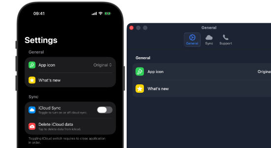

# SettingsKitUI
<div align="center">


</div>
### 🛑 Currently this package is under initial development phase
🚧 This package in development so expect API changes until stable release appear. Thank you for your understanding.🚧

A composable, cross-platform SwiftUI UI library for building beautiful, native-feeling Settings screens across iOS, iPadOS, macOS, watchOS, and visionOS.

<div align="center">



</div>

[](https://swift.org)
[](https://swift.org)
[](https://img.shields.io/badge/Swift_Package_Manager-compatible-orange)
[](https://haarisiqubal.github.io/SettingsKitUI/documentation/settingskitui/)
[](LICENSE.txt)


## Overview
When managing multiple apps, keeping settings views visually consistent across platforms often leads to massive code duplication and endless `#if os(macOS)` compiler checks.

**SettingsKitUI** solves this by providing highly abstract UI building blocks. It handles the platform-specific quirks, margins, and styling internally, allowing your app to focus purely on business logic and state management.

## Features
* **Write Once, Run Anywhere:** Components automatically adapt to look like native iOS grouped lists or clean macOS preference panes.
* **Highly Composable:** Built to feel exactly like native SwiftUI. Stack rows inside sections, and sections inside lists.
* **App-Agnostic:** The package knows nothing about your `@AppStorage`, CloudKit containers, or Core Data. It just renders the UI.

## Installation

**Swift Package Manager**
1. In Xcode, go to **File > Add Package Dependencies...**
2. Paste the URL of this repository.
3. Add **SettingsKitUI** to your app targets.

## Getting Started

- [https://haarisiqubal.github.io/SettingsKitUI/documentation/settingskitui/gettingstarted](Getting Started)

## Quick Start

Import the module and replace your standard `List` and `Section` with `SKList` and `SKSection`.

```swift
import SwiftUI
import SettingsKitUI

struct AppSettingsView: View {
    @AppStorage("isPro") private var isPro = false
    @AppStorage("iCloudSync") private var iCloudSync = false
    
    var body: some View {
        NavigationStack {
            SKList {
                
                // MARK: Account Section
                SKSection {
                    SKToggleRow(
                        icon: "icloud.fill",
                        iconColor: .blue,
                        title: "iCloud Sync",
                        subtitle: "Sync data across devices",
                        isOn: $iCloudSync
                    )
                    
                    SKActionRow(
                        icon: "star.fill",
                        iconColor: .yellow,
                        title: "Unlock Premium",
                        subtitle: isPro ? "Active" : "Tap to view plans"
                    ) {
                        print("Show paywall")
                    }
                } header: {
                    Text("Account")
                } footer: {
                    Text("Data is securely synced to your private iCloud database.")
                }
                
                // MARK: Legal Section
                SKSection {
                    SKNavigationRow(
                        icon: "hand.raised.fill",
                        iconColor: .pink,
                        title: "Privacy Policy"
                    ) {
                        PrivacyView()
                    }
                } header: {
                    Text("About")
                }
                
            }
            .navigationTitle("Settings")
        }
    }
}
